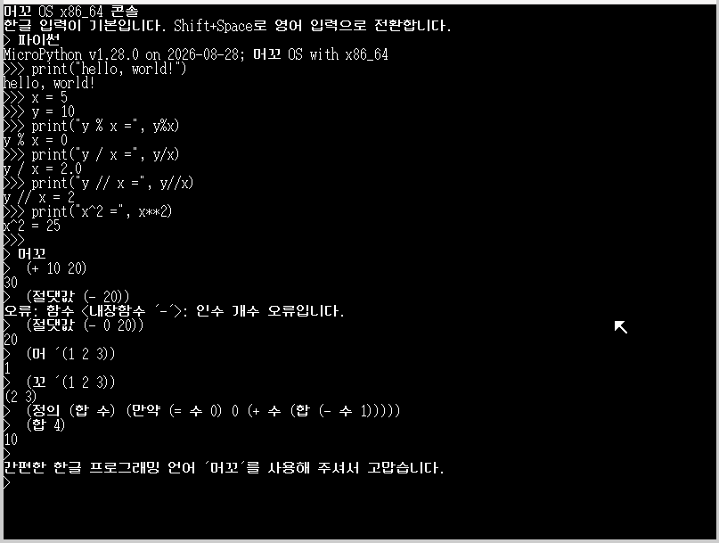
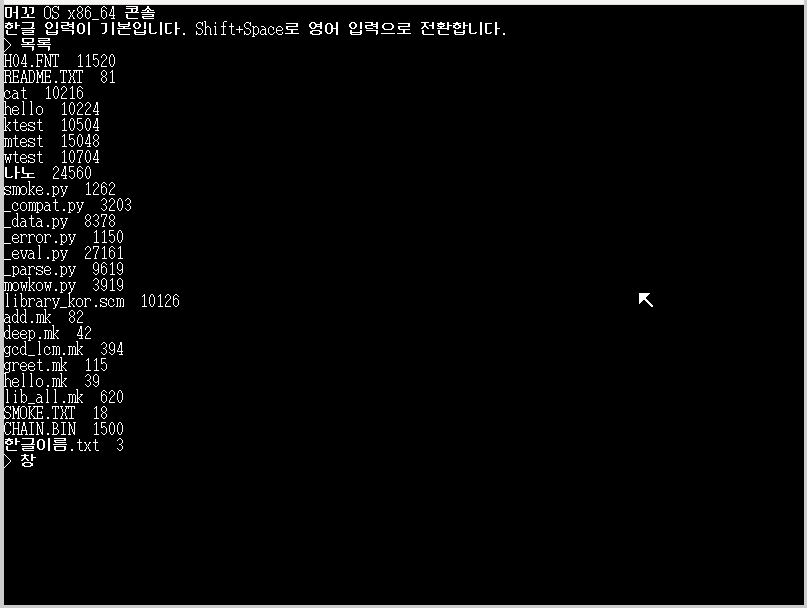
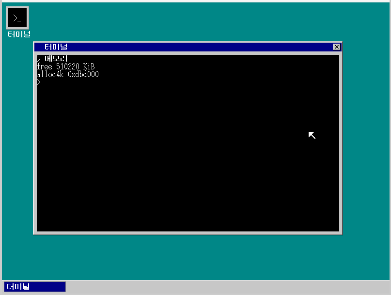
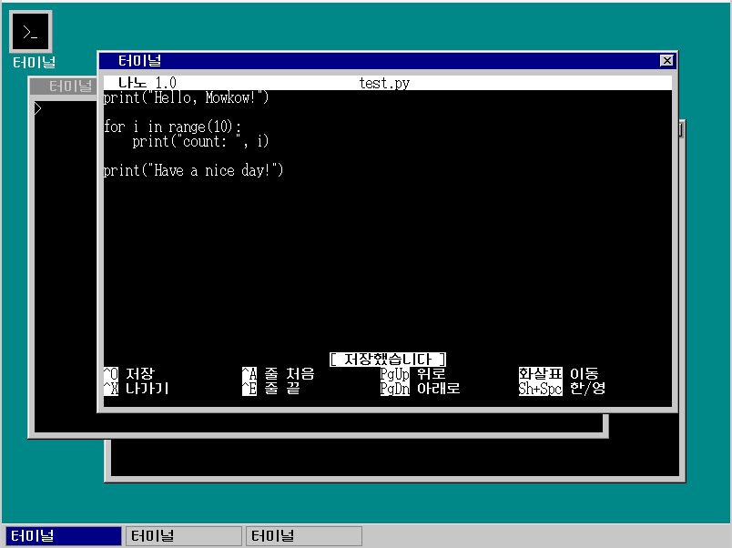
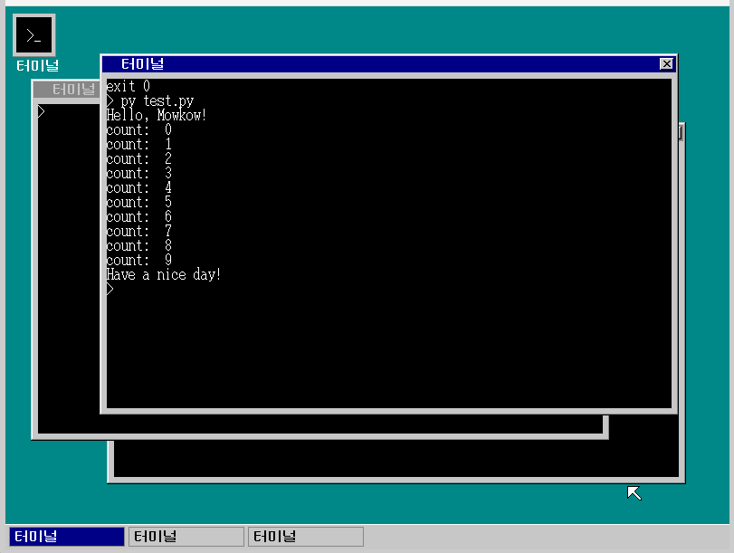
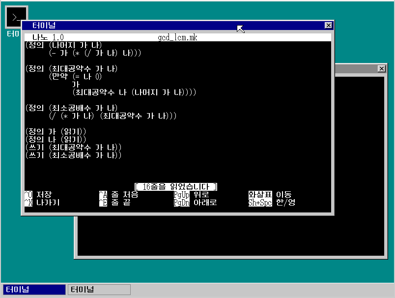
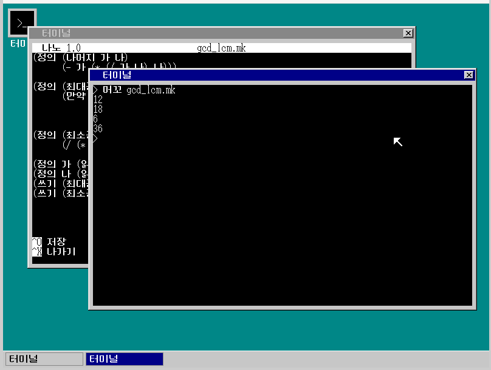

# Mowkow OS 64

## 실행 화면

### 1. 파이썬 REPL, 머꼬 REPL


### 2. CLI - GUI 전환
<p align="center">
    
    
</p>

### 3. 나노 에디터를 활용한 파이썬 코딩 및 실행
<p align="center">
    
    
</p>

### 4. 나노 에디터를 활용한 머꼬 코딩 및 실행
<p align="center">
    
    
</p>

## **머꼬 OS 소개**
### **머꼬 인터프리터와 GNU Nano가 내장된 32비트 교육용 한글 운영체제**
[Mowkow OS](https://github.com/yonghun8343/Mowkow-OS)는 『OS 구조와 원리』를 기반으로 만든 교육용 한글 운영체제입니다.
기본적인 커널 구조 위에 독자적인 한글 입력기를 구현하여 자유로운 한글 입출력이 가능합니다.
부산대학교 우균 교수님이 개발한 한글 LISP 머꼬 인터프리터를 내장하고 있습니다.

### **64bit로 확장**
32bit 머꼬 OS에는 다음과 같은 문제가 있었습니다.

1. 교재에서 제공하는 툴체인(`gocc1`, `nask` 등)에 갇혀 외부 소프트웨어 이식이 매우 제한적이었습니다.
2. 메모리 배치가 교재 기준으로 고정되어 있어 확장이 어려웠고, 앱 보호가 LDT 세그먼트에 의존하고 있어 롱 모드에서는 유지할 수 없었습니다.
3. 플로피 디스크와 FAT12(8.3 포맷)를 전제로 만들어져, 디스크 이미지를 통째로 메모리에 올려두어야 했고 실제 디스크에 얹을 수 없었습니다.

이 문제를 해결하려고 64bit 마이그레이션을 결정했습니다.

### 목차
* [0. 마이그레이션 요약](#0-마이그레이션-요약)
* [1. 64bit 빌드 시스템](#1-64bit-빌드-시스템)
* [2. x86 빌드 및 실행 방법](#2-x86-빌드-및-실행-방법)

    * [2-1. 준비물](#2-1-준비물)
    * [2-2. 빌드와 실행](#2-2-빌드와-실행)
    * [2-3. 부팅이 이상할 때](#2-3-부팅이-이상할-때)
* [3. Raspberry Pi 5 이미지 빌드 및 부팅 방법](#3-raspberry-pi-5-이미지-빌드-및-부팅-방법)

    * [3-1. 준비물](#3-1-준비물)
    * [3-2. 빌드](#3-2-빌드)
    * [3-3. SD 카드 준비와 부팅](#3-3-sd-카드-준비와-부팅)
* [4. 64bit 명령어 목록](#4-64bit-명령어-목록)
* [5. 64bit 시스템 구조](#5-64bit-시스템-구조)
* [6. 진행 상황](#6-진행-상황)
* [7. 주의할 점](#7-주의할-점)

---

## 0. 마이그레이션 요약
32bit 하드웨어가 제공하던 기능(TSS 전환, LDT 보호, RAM 디스크)을 소프트웨어로 재건하며 시스템을 계층화하였습니다.
부트 시퀀스에 자체 점검 단계를 넣었고, 교재 툴체인에서 표준 툴체인으로 넘어오면서 MicroPython 같은 외부 소프트웨어를 쓸 수 있게 되었습니다.

| | 32bit (`32bit/src`, `32bit/app`) | 64bit (`64bit/src64`, `64bit/app64`) |
|-|-|-|
| CPU 모드 | 보호 모드, 세그먼트 기반 | 롱 모드, 2MiB 페이지 아이덴티티 매핑 |
| 툴체인 | 교재 도구 (`nask`, `gocc1`, `bim2hrb`) | `x86_64-elf-gcc`, `nasm -f elf64`, `x86_64-elf-ld` |
| 부팅 매체 | 플로피, FAT12 | IDE/AHCI 하드디스크, FAT32 + VFAT 긴 이름 |
| 파일 접근 | 디스크 이미지 전체를 RAM에 상주 | 섹터 캐시를 거친 실제 블록 I/O |
| 태스크 전환 | TSS 하드웨어 전환 (`farjmp`) | 소프트웨어 문맥 저장 (`context_switch64`) |
| 앱 실행 형식 | `.hrb` ("Hari" 시그니처) | 정적 ELF64 (`ET_EXEC`, `PT_LOAD`만) |
| 앱 격리 | 태스크마다 LDT 세그먼트 | 링 3 + 커널의 포인터 범위 검사 |
| 시스템 콜 | `int 0x40`, 함수 번호 EDX | `int 0x80`, 번호 RAX / 인자 RDI RSI RDX R10 R8 R9 |
| 콘솔 | 콘솔 태스크 하나 | 최대 4개, 각각 태스크 + 창 + 키 FIFO |
| 스크립트 언어 | 머꼬 (C로 다시 씀) | MicroPython v1.28 (커널에 링크), 그 위에서 머꼬 원본 파이썬 소스 |

## 1. 64bit 빌드 시스템

| | 32bit | 64bit |
|-|-|-|
| 명령 | `make`, `make run`, `make iso` | `make x86_64`, `make run64`, `make run64-ahci` |
| 규칙 파일 | `32bit/mk/x86.mk` | `64bit/mk/x86_64.mk` + `64bit/mk/micropython.mk` |
| 산출물 | `img/haribote.img` (Floppy) | `img64/mowkow64.img` (FAT32 64MiB) |
| 앱 링크 | `obj2bim` -> `bim2hrb` | `x86_64-elf-ld` + `app64.ld` + crt |

### 1-1. 64bit 주요 기능

* 아키텍처: x86-64 롱 모드 (PAE, 4단계 페이지 테이블, 소프트웨어 태스크 스위치)
* 화면: 800x600 256색 (VBE 선형 프레임 버퍼)
* 한글화: 두벌식 오토마타와 조합형 글꼴을 커널이 관리
* 파일 시스템: FAT32 읽기/쓰기, VFAT 긴 이름 지원
* 저장 장치: AHCI(SATA)를 먼저 찾고, 없으면 ATA PIO를 사용
* 창 화면: `창`/`window` 명령어를 입력하면 GUI로 전환
* 파이썬: MicroPython이 커널에 함께 링크되어 있어 `py` 명령어로 사용 가능
* 머꼬: 원본 파이썬 소스를 그대로 이식하여 `머꼬` 명령어로 사용 가능 ([5-8](#5-8-머꼬-인터프리터))
* 앱: 나노 편집기를 비롯한 ELF64 응용 프로그램

## 2. x86 빌드 및 실행 방법
### 2-1. 준비물
64bit 트리는 교재 도구가 아니라 GNU 크로스 툴체인(GCC 13.1.0, binutils 2.40)을 사용합니다.

* 개발 환경: `Ubuntu 24.04.4 LTS(WSL2)`
* 아키텍처: `x86-64`
* 툴체인:

    * `x86_64-elf-gcc`, `x86_64-elf-ld`, `x86_64-elf-objcopy`
    * `nasm`
    * `qemu-system-x86_64`
    * `python3` (이미지 생성 도구)

#### 크로스 툴체인 설치 방법
```bash
sudo apt install build-essential bison flex libgmp-dev libmpc-dev libmpfr-dev texinfo
```
```bash
export PREFIX="$HOME/opt/cross"
export TARGET=x86_64-elf
export PATH="$PREFIX/bin:$PATH"
```
```bash
# binutils 2.40
tar xf binutils-2.40.tar.xz && mkdir build-binutils && cd build-binutils
../binutils-2.40/configure --target=$TARGET --prefix="$PREFIX" \
    --with-sysroot --disable-nls --disable-werror
```
```bash
make -j$(nproc) && make install && cd ..
```
```bash
# gcc 13.1.0
tar xf gcc-13.1.0.tar.xz && mkdir build-gcc && cd build-gcc
../gcc-13.1.0/configure --target=$TARGET --prefix="$PREFIX" \
    --disable-nls --enable-languages=c --without-headers
make -j$(nproc) all-gcc all-target-libgcc
make install-gcc install-target-libgcc
```

#### `make x86_64`가 컴파일러를 못 찾는 경우
```bash
make x86_64 X64_CC=/path/to/x86_64-elf-gcc X64_LD=/path/to/x86_64-elf-ld
```

### 2-2. 빌드와 실행

```bash
make x86_64         # img64/mowkow64.img 만들기
make run64          # IDE로 실행 (ATA PIO 경로)
make run64-ahci     # q35 + AHCI로 실행 (AHCI 경로)
make parity64       # 머꼬 병행 검사 (호스트 CPython과 견주기)
make clean64        # build64/, img64/ 지우기(rm)
```

`make help`를 치면 32bit와 64bit 명령이 함께 출력됩니다.

`run64`와 `run64-ahci`는 같은 이미지를 서로 다른 저장 장치 경로로 띄웁니다.
q35에는 레거시 IDE가 없으므로, 저장 장치 쪽을 수정했다면 두 명령어를 모두 시도해 봐야 합니다.

### 2-3. 부팅이 이상할 때
콘솔이 뜨기 전 단계에서는 화면에 아무것도 출력할 수 없습니다.
따라서 커널이 진행 상황을 COM1(시리얼)로 내보냅니다.
QEMU에 `-serial stdio`를 붙이면 아래와 같이 확인할 수 있습니다.

```
Mowkow OS x86_64 kernel64_main
fpu smoke=2
disk transport=ata part-base=0
fat32 files=8
fat32 write=18 sectors=0
fat32 chain=ok
fat32 lfn=ok
sheet64 smoke=ok
keyboard64 smoke=ok
hangul64 smoke=ok
hangul font=loaded
```

위 출력은 부팅마다 수행되는 자체 점검입니다.
멈춘 위치가 깨진 위치입니다. `sectors=0`은 오류가 아니라, 이미 디스크에 쓰기가 끝나서 내보낼 것이 없다는 뜻입니다.

## 3. Raspberry Pi 5 이미지 빌드 및 부팅 방법

Raspberry Pi 5 포트는 펌웨어가 `0x80000` 주소에 직접 적재하는 AArch64 flat image를 사용합니다. 현재 빌드는 SD 카드 전체에 쓰는
raw 이미지가 아니라, FAT32 부트 파티션에 복사할 파일 묶음을 만들기 때문에 `img64/mowkow-pi5.img`를 찾거나 `dd`로 기록하면 안 됩니다.

### 3-1. 준비물

* Raspberry Pi 5, microSD 카드, HDMI 디스플레이
* 부팅 전에 연결한 USB 키보드, 마우스
* `aarch64-none-elf-gcc`, `aarch64-none-elf-ld`,
  `aarch64-none-elf-objcopy`
* `make`, `python3`
* 초기화된 `third_party/micropython` 서브모듈

처음 clone한 저장소라면 서브모듈부터 준비합니다.

```bash
git submodule update --init --recursive
```

### 3-2. 빌드

저장소 루트에서 다음 명령을 실행합니다.

```bash
make aarch64
```

빌드가 끝나면 다음 두 산출물이 생깁니다.

* `build64/aarch64/kernel_2712.img`: Raspberry Pi 펌웨어가 적재하는 커널 이미지
* `build64/aarch64-boot/`: SD 카드 부트 파티션에 복사할 완성 파일 묶음

`aarch64-boot/`에는 `config.txt`, `kernel_2712.img`, 한글 글꼴, AArch64 앱, MicroPython 및 머꼬 스크립트가 함께 들어갑니다. staging만 다시 동기화하려면 `make aarch64-stage`, AArch64 산출물을 지우려면 `make clean-a64`를 사용합니다.

기본 경로에서 크로스 툴체인을 찾지 못하면 도구 경로를 지정할 수 있습니다.

```bash
make aarch64 \
  A64_CC=/path/to/aarch64-none-elf-gcc \
  A64_LD=/path/to/aarch64-none-elf-ld \
  A64_OBJCOPY=/path/to/aarch64-none-elf-objcopy
```

### 3-3. SD 카드 준비와 부팅

1. SD 카드에 MBR 파티션 테이블과 FAT32 LBA(type `0x0c`) 부트 파티션을 준비합니다. 데이터가 지워질 수 있으므로 장치 이름을 반드시 확인하고, 가능하면 비어 있는 전용 카드를 사용합니다.
2. FAT32 부트 파티션을 마운트한 뒤 `build64/aarch64-boot/` 안의 파일을 디렉터리 자체가 아니라 파티션 루트에 모두 복사합니다.

   ```bash
   cp -R build64/aarch64-boot/. /path/to/mounted-boot-partition/
   sync
   ```

3. 파티션을 안전하게 마운트 해제하고 SD 카드를 Raspberry Pi 5에 넣습니다.
4. HDMI와 USB 키보드(필요하면 마우스)를 먼저 연결한 다음 전원을 넣습니다.

Pi 5의 부트 펌웨어는 EEPROM에 있으므로 `bootcode.bin`, `start.elf`, UEFI 파일은 필요하지 않습니다. 저장소의 `config.txt`는 `kernel_2712.img`를 `0x80000`에 적재하고, RP1 USB를 위해 PCIe 링크를 유지하도록 설정되어 있습니다.

정상 부팅 조건:

* Mowkow OS 콘솔 출력
* 녹색 ACT LED가 0.5초 간격으로 점멸

화면이 나오지 않으면 먼저 다음을 확인합니다.

* `config.txt`와 `kernel_2712.img`가 하위 디렉터리가 아닌 FAT32 루트에 있는지
* staging의 `H04.FNT`와 앱·스크립트 파일을 빠짐없이 복사했는지
* USB 키보드를 전원을 넣기 전에 연결했는지
* ACT LED가 일정한 heartbeat 대신 반복적인 panic 점멸 패턴을 보이는지

## 4. 64bit 명령어 목록

### 4-1. 애플리케이션 실행
애플리케이션 이름만 입력하면 실행됩니다.

```bash
# 예) 나노 편집기 열기
> 나노

# 예) 나노 편집기로 텍스트 파일 열기
> 나노 README.TXT

# 예) 파일 내용 보기
> cat readme.txt
```

내장 명령이 아닌 낱말이 들어오면 FAT32에서 같은 이름의 실행 파일을 찾고, 없으면 `알 수 없는 명령어`라고 알립니다.

### 4-2. CLI-GUI 전환
```bash
# 한글 명령어
> 창

# 영어 명령어
> window
```

화면 출력 모드를 변경합니다.
GUI 모드에서는 마우스로 제목 표시줄을 끌어 창을 옮기거나, 창을 클릭해 활성 창을 바꿀 수 있습니다.
전체 화면 토글은 부팅 콘솔(콘솔 0)에서만 동작합니다.

```bash
# 콘솔 하나 더 띄우기 (최대 4개)
> 새창
> new
```

콘솔마다 자기 태스크가 있어서 창을 닫아도(숨겨도) 계속 실행됩니다.
바탕화면 아이콘으로도 새 콘솔을 띄울 수 있고, 작업 표시줄에서 숨긴 콘솔을 되살릴 수 있습니다.

### 4-3. 파이썬
```bash
# REPL 시작 (Ctrl-D로 나감)
> py

# 파일 실행
> py TEST.PY
```

### 4-4. 머꼬
```bash
# REPL 시작 (빈 줄, Ctrl-C, Ctrl-D 중 아무거나로 나감)
> 머꼬

# 파일 실행
> 머꼬 hello.mk
```

```
> 머꼬
>  (정의 (제곱 수) (* 수 수))
>  (제곱 12)
144
>  0육ㄱ
10
>  
간편한 한글 프로그래밍 언어 '머꼬'를 사용해 주셔서 고맙습니다.
```

커널 콘솔과 같은 명령줄 인터페이스를 사용하므로 동일하게 한글을 입력할 수 있습니다.
머꼬 실행 환경을 한 번 만든 뒤로는 `library_kor.scm`을 다시 읽지 않으므로 두 번째부터는 바로 뜹니다.

### 4-5. 기타 명령어
```bash
> help
> 목록 / ls # 파일 목록
> 메모리 / mem # 남은 메모리
> 지우기 / clear # 화면 지우기
> 태스크 / tasks # 태스크 전환 횟수
> ticks # 타이머 틱
> 읽기 / type # 파일 내용 보기
> 실행 / run # 실행 파일 실행 (예: run HELLO)
```

## 5. 64bit 시스템 구조
### 5-1. 부트 시퀀스
부트 섹터 512바이트 안에 FAT32 BPB와 롱 모드 진입 코드를 함께 넣을 수 없어 1단계는 BPB와 디스크 읽기만 담고 나머지를 2단계로 넘겼습니다.

```
boot64.asm (1단계, 부트 섹터 512B, LBA 0)
  └ FAT32 BPB 내장, int 13h AH=42h로 2단계 로더 읽기
    └ loader64.asm (2단계, 0x8000)
      └ 커널 읽기(LBA 32), VBE 0x4103, boot_info 수집, A20
        └ 보호 모드 → 페이지 테이블, PAE, EFER.LME, CR0.PG → 롱 모드
          └ _start (asmfunc64.asm)
            └ 스택 설정, .bss를 0으로 채움
              └ kernel64_main (kernel64.c)
```

* `_start`가 `.bss`를 직접 0으로 채우는 이유

    * 로더는 항상 `KERNEL64_SECTORS × 512`바이트를 통째로 디스크에서 메모리로 옮기는데, 그 범위가 `.bss`의 적재 주소를 넘어서기 때문에 `.bss`를 미리 0으로 채워놓지 않으면 해당 자리에 0이 아니라 디스크에 있던 내용이 들어옵니다.

* BIOS 제약

    * `int 13h AH=42h`는 한 번에 128섹터(64KiB)까지만 읽습니다. 더 요청하면 실패합니다.
    * `int 0x13`은 EAX를 보존하지 않습니다(SeaBIOS가 내부 LBA 계산에 사용). 그래서 진행 중인 LBA 값을 레지스터가 아니라 메모리에 둡니다.

`kernel64_main` 초기화 순서
```
1. GDT/IDT, FPU
2. 메모리 관리자
3. 저장 장치 전송 계층 (AHCI 또는 ATA)
4. FAT32
5. 한글 글꼴 (디스크에서 H04.FNT 읽기)
6. 팔레트, 콘솔
7. 태스크, 이벤트 큐, 콘솔 태스크 시작
8. 타이머(PIT), PIC
9. sti
10. 키보드, 마우스
11. 이벤트 루프
```

### 5-2. 메모리 배치
32bit에서 하드코딩되어 있던 주소를 64bit는 정책선 세 개로 줄였습니다.

| 구간 | 용도 | 비고 |
|-|-|-|
| `0x00100000` | 커널 이미지 (.text/.rodata/.data/.bss) | `kernel64.ld`가 1MiB에 링크 |
| `0x00400000`-`0x00800000` | 유저 이미지 창 | 메모리 풀 바깥. `app64.ld`가 모든 앱을 `0x400000`에 링크 |
| `0x00800000`-`0x20000000` | 일반 메모리 풀 (`memman64`) | `MEMMAN64_EARLY_START` ~ `_END` |

할당기는 32bit와 같은 free-list 방식이지만, 콘솔마다 태스크가 생기면서 타이머 인터럽트가 free-list 조작 중간에 선점할 수 있게 되었기 때문에 모든 조작이 `io_cli`/`io_store_rflags` 임계 구역 안에서 수행됩니다.

### 5-3. 태스크 전환
32bit는 태스크마다 TSS와 LDT 디스크립터를 GDT에 만들고 `farjmp` 한 번으로 전환했습니다.

하지만 롱 모드에는 하드웨어 태스크 전환이 없기 때문에 `mtask64.c`가 직접 전환합니다.

```asm
context_switch64:          ; rdi = 현재 문맥, rsi = 다음 문맥
    push rbx / rbp / r12 / r13 / r14 / r15   ; 콜리 세이브 레지스터만
    mov [rdi], rsp                            ; 현재 rsp 저장
    mov rsp, [rsi]                            ; 다음 rsp 로드
    pop r15 / r14 / r13 / r12 / rbp / rbx
    ret                                       ; 새 스택의 복귀 주소로
```

스케줄러 정책(레벨 10단, 레벨 안에서 라운드 로빈, 잠든 태스크는 큐에서 제외, 최하위 레벨에 idle 태스크)은 32bit와 같습니다. 추가된 것은 두 가지입니다.

* `task_kill64` — 콘솔 창을 닫으면 태스크를 죽이고 스택을 반납합니다. 자기 자신은 죽이지 않습니다(돌아갈 스택이 사라지기 때문).
* `struct TASK64`의 `process`/`is_user`/`kernel_rsp` — 시스템 콜이 현재 실행 중인 프로세스를 태스크에서 찾습니다.

### 5-4. 유저 프로그램 ABI
32bit 앱은 `.hrb` 형식이었고, 태스크마다 만든 LDT 세그먼트의 베이스와 리밋이 앱을 커널에서 격리했습니다.
그러나 롱 모드에는 그 수단이 없고 페이징 격리도 아직 없기 때문에 커널이 유저 포인터를 직접 검사하여 영역 침범을 방지합니다.
(페이징 격리는 앞으로 추가할 예정입니다.)

```c
int process64_user_range_valid(const void *ptr, size_t size)
    // 현재 프로세스의 image / stack / heap 구간 중 하나에 완전히 들어가는가
```

| 번호 | 이름 | 비고 |
|-|-|-|
| 1 | `SYS_EXIT` | 커널 스택으로 되돌아가는 유일한 경로 |
| 2 / 3 | `SYS_WRITE` / `SYS_READ` | fd 0·1·2는 프로세스를 띄운 콘솔, 3 이상은 파일 |
| 4 / 5 / 6 | `SYS_OPEN` / `CLOSE` / `SEEK` | `O_CREAT`, `O_TRUNC` 플래그. 별도 CREATE 없음 |
| 7 / 8 | `SYS_ALLOC` / `SYS_FREE` | 프로세스 힙의 bump 할당. FREE는 범위 검증만 함 |
| 9 | `SYS_TICKS` | 타이머 틱 (100Hz) |
| 10 | `SYS_TTY` | 연산 코드를 RDI에 실은 다중화 콜 |

진입은 `enter_user_mode64`가 스택에 SS/RSP/RFLAGS/CS/RIP를 쌓고 `iretq`로 링 3에
들어가는 방식입니다. 반대로 `SYS_EXIT`은 `iretq`로 돌아오지 않고, 저장해 둔 커널
`rsp`를 복원한 뒤 일반 함수처럼 반환합니다.

`SYS_TTY`는 나노 같은 전체 화면 편집기를 위한 raw 모드(줄 편집과 에코 끄기)를 제공합니다. `TTY_READKEY`가 돌려주는 64비트 값에 한글 조합 중 상태가 함께 실립니다.

### 5-5. 저장 장치 계층
```
fd64.c FAT32 + VFAT 긴 이름
    ↓
cache64.c 되쓰기 섹터 캐시 (4KiB 블록, 4MiB)
    ↓
block64.c 전송 계층 고르기 + 파티션 시작 위치
    ↓
ahci64.c / ata64.c
```

전송 계층을 추가하고 싶다면 `struct BLOCK64_OPS`만 채우면 됩니다.
그 위 계층은 손대지 않아도 됩니다.

### 5-6. 디스크 배치 (64MiB 이미지)
```
LBA 0           부트 섹터 (FAT32 BPB)
LBA 1           FSInfo
LBA 6, 7        부트 섹터/FSInfo 사본
LBA 8..23       2단계 로더
LBA 32..1023    커널 이미지 (예약 영역)
LBA 1024        FAT #1
LBA 2025        FAT #2
LBA 3026        데이터 영역, 클러스터 2 = 루트 디렉터리
```

2단계 로더와 커널이 예약 영역에 있으므로 커널이 커져도 파일 시스템이 밀리지 않습니다.
이 배치는 `64bit/tools/mkfat32_64.py` 한 곳에만 적혀 있고, Makefile과 부트 섹터가 해당 파일에서 값을 읽습니다.
배치를 바꿔야 하면 Makefile이나 BPB를 직접 고치지 말고, `64bit/tools/mkfat32_64.py`를 고쳐야 합니다.

### 5-7. GUI와 다중 콘솔
시트 합성기(`sheet64.c`)는 32bit `sheet.c`를 그대로 이식했고, 실질적인 차이는 `stride` 필드뿐입니다. VBE 모드에서는 한 행의 바이트 수가 가로 픽셀 수와 다를 수 있어 분리했고, 부팅 자체 점검이 `stride > xsize` 경로를 일부러 만들어 검사합니다.

다중 콘솔을 지원하기 위해 콘솔의 상태를 `struct CONSOLE64`에 저장하고, 콘솔마다 태스크, 256KiB 스택, 키 FIFO를 둡니다. 콘솔은 한 번에 최대 4개 띄울 수 있습니다.

* 숨긴 콘솔도 계속 실행되고, GUI는 반응합니다.
* 바탕화면 아이콘이 새 콘솔을 띄우고, 작업 표시줄이 숨긴 콘솔을 되살립니다.
* 전체 화면 토글(`창`/`window`)은 콘솔 0 전용입니다. 화면 크기 버퍼가 있는 콘솔이 0번뿐이기 때문입니다.

키 라우팅은 커널 이벤트 루프가 먼저 창 계층에 넘기고(마우스와 F11은 창이 가져감), 남은 키만 포커스가 있는 콘솔의 태스크로 보냅니다. 콘솔이 아닌 창이 활성이면 키는 아무 데도 가지 않습니다.

동시성은 타이머 인터럽트가 유일한 선점 원인이므로 `io_cli`/`io_sti` 임계 구역으로 충분합니다. 뮤텍스가 필요하지 않다고 판단해 트리에 두지 않고 Giant Lock 하나로 처리했습니다. 대신 임계 구역 안에서 `task_sleep64`를 부르지 않도록 합니다.

### 5-8. 머꼬 인터프리터
64bit 머꼬 OS는 원본 파이썬 소스를 커널에 링크된 MicroPython에서 실행합니다.

```
콘솔: 머꼬 [파일]
  └ mpport_run_mowkow()          "import mowkow; mowkow.main()"을 컴파일
      └ mowkow.py                진입점 (업스트림 main.py 대신)
          ├ base_env()           내장 함수 + library_kor.scm, 부팅마다 한 번
          └ mkenv(base_env())    세션마다 새 틀
              └ _parse/_eval/_data/_error    업스트림 소스 (1093줄)
                  └ _compat.py   MicroPython에 없는 CPython 동작만 되살림
                      └ mowio    커널로 나가는 창구 (C, modmowio.c)
```

업스트림([woogyun/mowkow](https://github.com/woogyun/mowkow), 커밋 `1dae112`)은 `64bit/py64/머꼬/upstream/`에 그대로 두고, 실제 실행되는 사본은 `64bit/py64/머꼬/`에 두었습니다.
둘의 차이는 의존성 계층뿐이며 파서와 계산기는 건드리지 않았습니다.

네 파일에서 바뀐 줄은 38줄이며, `diff -r 64bit/py64/머꼬/upstream 64bit/py64/머꼬`로 확인할 수 있습니다.

`mowio`는 표준 라이브러리 대신 커널을 부르는 코드입니다.

| `mowio` | 대신하는 것 | 이유 |
|-|-|-|
| `readline(프롬프트)` | `input()` | MicroPython의 입력은 바이트 단위라 3바이트 음절을 백스페이스로 깨뜨립니다. 콘솔의 명령 줄 인터페이스를 그대로 호출하여 실시간 조합도 적용합니다. |
| `readfile(경로)` | `io.open()` | POSIX 파일이 없습니다. `fd64`로 읽고 UTF-8을 검사합니다. |
| `argv()` | `sys.argv` | 문자열 파싱만을 위해 sys 라이브러리를 가져오기에는 비용이 너무 큽니다. |
| `ticks()` | `time` | 시작 시간 측정에만 씁니다. |

`_compat.py`에는 업스트림 소스가 쓰는 것 중 MicroPython에 없는 것을 채우는 shim 코드 여섯 개가 있습니다.

머꼬를 쓰려면 먼저 `library_kor.scm` 252줄을 계산해서 기본 함수들(`머리`, `거꾸로`, `맵` 등)을 환경에 채워 넣어야 합니다. 이 준비에 1.4초가 걸립니다.

명령이 끝날 때마다 MicroPython을 정리하면 `머꼬`를 부를 때마다 준비 시간 1.4초가 걸리므로 정리(`mp_deinit()`)하지 않고 해석기를 부팅 내내 켜 둡니다. 준비된 환경이 파이썬 모듈 안에 그대로 남아 있기 때문에, 첫 `머꼬` 실행에만 1.4초가 걸리고 두 번째 실행부터는 곧바로 실행됩니다.

세션마다 그 환경 위에 새 환경을 하나 덮어쓰기 때문에 앞 세션에서 만든 정의는 다음 세션에 보이지 않지만, 라이브러리는 다시 계산하지 않고 물려받습니다.

### 5-9. 빌드 구성
Makefile은 트리별로 나뉘어 있습니다.

```
Makefile                   기본 목표, help, info
common/mk/config.mk        디렉터리, 도구, 컴파일 옵션 (공통)
32bit/mk/x86.mk            32bit 빌드 규칙
64bit/mk/micropython.mk    MicroPython 빌드 규칙
64bit/mk/x86_64.mk         64bit 빌드 규칙
```

### 5-10. 프로젝트 디렉터리
```
.
├── Makefile                    # 전체 빌드 진입점과 help/info 목표
├── arch.md                     # Raspberry Pi 5 AArch64 포팅 설계와 검증 기록
├── 📂common                    # 32/64비트 트리가 함께 쓰는 파일
│   ├── 📂mk                    # config.mk (공용 경로와 도구 설정)
│   └── 📂font                  # H04.FNT, E2.FNT, hankaku 비트맵 글꼴
├── 📂32bit                     # 기존 32비트 보호 모드 트리
│   ├── 📂src                   # boot, kernel, drivers, lib, include
│   ├── 📂app                   # 32비트 HRB 응용 프로그램과 API
│   ├── 📂mk                    # x86.mk 빌드 규칙
│   ├── 📂tools                 # nask, gocc1, obj2bim, bim2hrb, edimg
│   ├── 📂testfiles             # FAT12 이미지에 넣는 시험 파일
│   └── 📂ASM                   # 교재 어셈블리 자료
├── 📂64bit                     # x86_64와 AArch64가 공유하는 64비트 트리
│   ├── 📂mk
│   │   ├── x86_64.mk           # x86_64 커널·앱·FAT32 이미지 빌드
│   │   ├── aarch64.mk          # Pi 5 커널·앱·부트 staging 빌드
│   │   └── micropython.mk      # 아키텍처별 MicroPython 생성물과 링크 규칙
│   ├── 📂board/pi5
│   │   ├── config.txt          # Pi 5 펌웨어 부팅 설정
│   │   └── README.md           # bring-up 단계, panic code, 실기 검증 기록
│   ├── 📂tools
│   │   ├── mkfat32_64.py       # x86_64 FAT32 디스크 이미지 생성
│   │   ├── stage_aarch64_boot.py # Pi 5 부트 파티션 파일 묶음 생성
│   │   └── mowkow_parity.py    # 머꼬 CPython 병행 검사
│   ├── 📂src64                 # 공용 64비트 커널과 아키텍처 백엔드
│   │   ├── 📂boot              # x86_64 1·2단계 부트로더
│   │   ├── 📂arch/aarch64      # EL1 진입, MMU/GIC/타이머, SDHCI, RP1/xHCI/HID
│   │   ├── 📂drivers           # x86_64 장치 드라이버와 공용 block/graphic 계층
│   │   ├── 📂kernel            # console, FAT32/cache, task, GUI, process/syscall
│   │   ├── 📂lib               # Hangul, UTF-8, FIFO, keymap, 문자열
│   │   ├── 📂mpport            # MicroPython 포트와 아키텍처별 최소 libc/math
│   │   └── 📂include
│   │       └── 📂arch          # 공용 아키텍처 HAL과 exception frame 계약
│   ├── 📂app64                 # 두 아키텍처용 정적 ELF64 응용 프로그램
│   │   ├── 📂crt               # x86_64/AArch64 crt0, syscall, 문자열, malloc
│   │   ├── 📂hello             # 최소 실행 예제
│   │   ├── 📂cat               # 파일 내용 출력
│   │   ├── 📂ktest             # raw 키 입력 점검
│   │   ├── 📂mtest             # 사용자 heap 점검
│   │   ├── 📂wtest             # FAT32 쓰기 점검
│   │   └── 📂나노              # 나노 편집기 포트
│   └── 📂py64
│       ├── smoke.py            # MicroPython 통합 점검
│       ├── float_smoke.py      # AArch64 double/수학 연산 점검
│       └── 📂머꼬              # 인터프리터, 라이브러리, 예제와 upstream 원본
├── 📂screenshots               # README 실행 화면 이미지
└── 📂third_party
    └── 📂micropython           # 업스트림 MicroPython 서브모듈
```

`build/`, `build64/`, `img/`, `img64/`는 빌드 때 생기는 생성물이므로 위 트리에서
제외했습니다.

## 6. 진행 상황

| 항목 | 상태 |
|-|-|
| 롱 모드 부팅 | ✅ |
| FAT32 읽기/쓰기 | ✅ |
| 한글 콘솔 (두벌식, UTF-8) | ✅ |
| 시트/창 컴포지터, 창 전환 | ✅ |
| 다중 콘솔 (콘솔당 태스크, 작업 표시줄) | ✅ |
| ELF64 유저 프로세스, 링 3 진입, 시스템 콜 | ✅ |
| 커널 내장 MicroPython | ✅ |
| 나노 편집기 | ✅ |
| 머꼬 인터프리터 (MicroPython 위에서) | ✅ |
| 프로세스별 주소 공간 (페이징 격리) | ❌ |
| 앱 동시 실행 | ❌ |

## 7. 주의할 점

### 7-1. 사용할 때
* 나노로 저장한 파일은 이미지 파일에 실제로 남습니다. `make clean64` 뒤 다시 빌드하면 새로 저장된 파일이 사라지니 주의하세요.
* 모든 파일은 루트 디렉터리에 위치합니다.
* 저장 장치 쪽을 수정했다면 `make run64`와 `make run64-ahci`를 모두 확인해야 합니다. q35에는 레거시 IDE가 없어 두 명령이 실제로 서로 다른 코드를 지나갑니다.
* 커널 크기 상한은 `64bit/mk/x86_64.mk`의 `KERNEL64_SECTORS`(현재 960섹터)입니다. 넘으면 링크 직후 빌드가 멈춥니다. 예약 영역이 1024섹터이고 커널은 LBA 32부터라 992섹터까지는 파일 시스템을 밀지 않고 올릴 수 있습니다.
* 머꼬 소스는 `64bit/py64/`에 두면 이미지 루트로 들어갑니다. 다만 파일을 지웠을 때는 make가 알아채지 못하니 `rm img64/mowkow64.img` 뒤에 다시 빌드하세요.

### 7-2. 존재하는 한계

| 한계 | 위치 | 결과 |
|-|-|-|
| 페이징 격리 없음 | 전체 | 유저 앱이 커널 메모리에 접근 가능. `process64_user_range_valid`가 유일한 방어선 |
| 이미지 창 소유자 하나 | `elf64_loader.c` | 앱은 시스템 전체에서 한 번에 하나만. 두 번째 요청은 거절 |
| 스택 가드 페이지 없음 | `process64.c` | 재귀가 깊은 프로그램이 유저 스택 64KiB를 넘겨 힙을 침범할 수 있음 |
| `SYS_FREE`가 실제로 반환하지 않음 | `syscall64.c` | 힙은 bump 할당. 범위 검증만 수행 |
| 캐시가 직접 매핑 | `cache64.c` | 충돌 시 즉시 축출. FAT은 낮은 LBA, 데이터는 높은 LBA라 실제 충돌은 드묾 |
| AHCI 포트 하나, NCQ 없음 | `ahci64.c` | 사용 가능한 첫 포트만. 폴링으로 한 번에 명령 하나 |
| ATA PIO는 명령당 1섹터 | `ata64.c` | 느림. 어디서나 부팅되는 것이 목적 |
| MicroPython 단일 인스턴스 | `mpport/` | GC 힙과 상태가 전역 하나. 콘솔마다 파이썬이나 머꼬를 돌릴 수 없고, 두 번째 요청은 거절됨 |
| 자동 테스트가 머꼬에만 있음 | 양쪽 트리 | `make parity64`가 머꼬를 호스트 CPython과 견줍니다. 커널 쪽은 부팅 시 COM1 자체 점검과 QEMU 수동 확인이 전부 |
| 머꼬가 느림 | `64bit/py64/` | 파이썬으로 쓴 트리 워커를 바이트코드 VM 위에서 돌림. 대화형으로는 괜찮지만 긴 스크립트는 눈에 띄게 느려짐 |
